# Disaster Rescue — Feature Documentation

> **Live Application**: [https://disaster-rescue-sigma.vercel.app/](https://disaster-rescue-sigma.vercel.app/)  
> **Last Updated**: March 8, 2026  
> A real-time Disaster Evacuation Management System built with React, Vite, Leaflet, and Supabase.

---

## Table of Contents

1. [Crisis Response Command — Landing Modal](#1-crisis-response-command--landing-modal)
2. [Global Situational Map Dashboard](#2-global-situational-map-dashboard)
3. [Disaster Analytics](#3-disaster-analytics)
4. [Relief Network — Volunteer Dashboard (I Can Help)](#4-relief-network--volunteer-dashboard-i-can-help)
5. [Relief Network — Request Assistance (I Need Help)](#5-relief-network--request-assistance-i-need-help)
6. [QR Code Payment Modal](#6-qr-code-payment-modal)
7. [Safety Guidelines](#7-safety-guidelines)
8. [Strategic Intelligence Feed (Live News)](#8-strategic-intelligence-feed-live-news)
9. [Disaster Detail Panel](#9-disaster-detail-panel)
10. [Live Wind / Cyclone Map Layer](#10-live-wind--cyclone-map-layer)
11. [Authentication — Login](#11-authentication--login)
12. [Authentication — Sign Up](#12-authentication--sign-up)

---

## 1. Crisis Response Command — Landing Modal

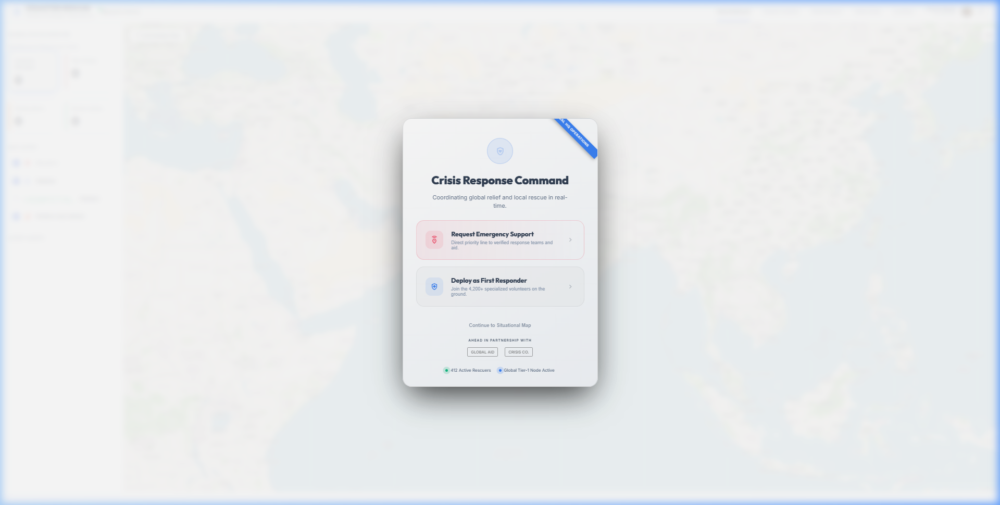

### Description
When the application first loads, a **Crisis Response Command** modal is displayed over the blurred map background. It acts as an entry hub, directing the user toward one of two immediate roles before proceeding to the full dashboard.

### Key Elements
| Element | Function |
|---|---|
| **Request Emergency Support** | Routes affected individuals to submit an emergency support request with direct priority connection to verified response teams. |
| **Deploy as First Responder** | Allows trained volunteers to join the network of 4,200+ deployed responders in the field. |
| **Continue to Situational Map** | Skips the role selection and opens the main command dashboard directly. |
| **Partnership Badges** | Displays affiliated organizations (Global Aid, Crisis Co.) for credibility. |
| **Live Status Indicators** | Shows "412 Active Rescuers" and "Global Tier-1 Node Active" in real-time. |

---

## 2. Global Situational Map Dashboard

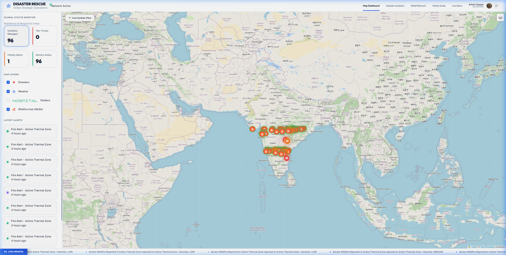

### Description
The **Map Dashboard** is the central command center of the application. It provides a real-time global view of all active disaster incidents plotted on a Leaflet-based interactive map, with a live sidebar for quick situational awareness.

### Key Elements

#### Left Sidebar — Global Status Monitor
| Metric | Description |
|---|---|
| **Incidents Managed** | Total disaster events currently being tracked (e.g., 96 active). |
| **Tier 1 Crisis** | Count of the highest-priority critical incidents. |
| **Priority Alerts** | Number of urgent alerts requiring immediate attention. |
| **Sectors Active** | Total geographic regions with active disaster coverage. |

#### Map Layers (Toggleable)
| Layer | Data Source | Description |
|---|---|---|
| **Disasters** | Supabase DB | Shows red incident markers for all active disasters. |
| **Weather** | Live API | Overlays real-time weather/cyclone data. |
| **Shelters** | Supabase DB | Shows hospital/shelter icons near disaster zones. |
| **Wildfire Intel (NASA)** | NASA FIRMS API | Satellite-detected thermal hotspots from NASA FIRMS/VIIRS SNPP. |

#### Latest Alerts Feed
A scrolling chronological list in the sidebar showing the most recent fire alerts and thermal zone detections with timestamps.

#### Live Updates Ticker
A marquee-style ticker at the bottom of the screen continuously scrolls real-time alert summaries with severity levels.

#### Top Navigation Bar
| Tab | Description |
|---|---|
| **Map Dashboard** | Returns to this main map view. |
| **Disaster Analytics** | Opens the analytics and reporting page. |
| **Relief Network** | Opens the volunteer/help request system. |
| **Safety Guide** | Opens disaster preparedness guidelines. |
| **Live News** | Opens the real-time intelligence news feed. |
| **User Profile** | Displays the logged-in user's avatar and name. |

---

## 3. Disaster Analytics

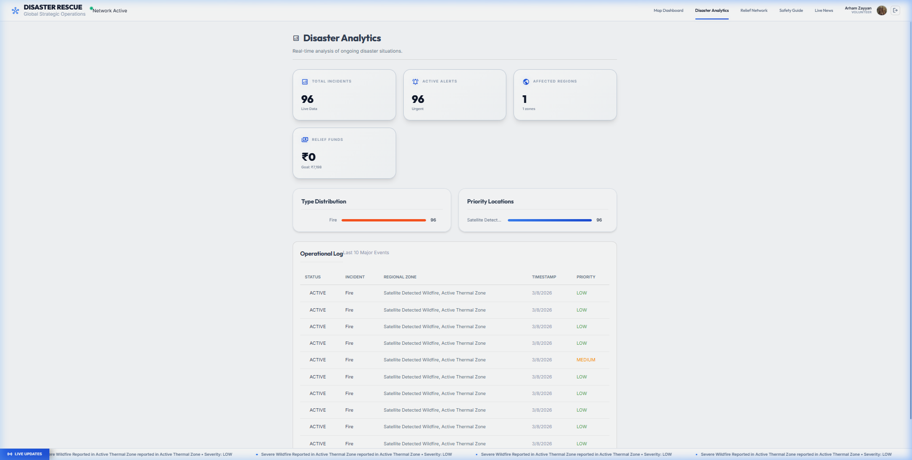

### Description
The **Disaster Analytics** page provides a comprehensive statistical and visual overview of all disaster data managed by the system. It helps administrators and coordinators understand incident patterns, affected areas, and relief fund status at a glance.

### Key Elements

#### Summary Metric Cards
| Metric | Description |
|---|---|
| **Total Incidents** | Live count of all disaster events in the database. |
| **Active Alerts** | Number of incidents currently flagged as urgent. |
| **Affected Regions** | Count of distinct geographic zones with active events. |
| **Relief Funds** | Total donations received vs. the fundraising goal (in ₹). |

#### Type Distribution Chart
A horizontal bar chart breaking down incidents by disaster type (e.g., Fire, Flood, Earthquake). Allows coordinators to identify the most prevalent threat categories.

#### Priority Locations Chart
A bar chart mapping incidents by detected satellite location zone, showing which detection areas have the highest concentration of events.

#### Operational Log
A detailed, tabular log of the **last 10 major events** with the following columns:
- **Status**: ACTIVE / RESOLVED
- **Incident Type**: Fire, Flood, etc.
- **Regional Zone**: Geographic description of the event location
- **Timestamp**: Date and time the event was recorded
- **Priority**: LOW / MEDIUM / HIGH / CRITICAL (color-coded)

---

## 4. Relief Network — Volunteer Dashboard (I Can Help)

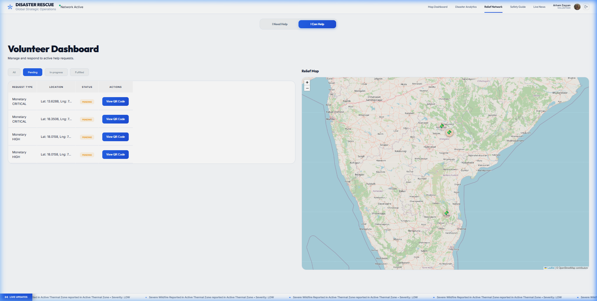

### Description
The **Volunteer Dashboard** is the "I Can Help" view of the Relief Network. Authenticated users who wish to provide aid can see all incoming assistance requests filtered by their status, along with a geographic relief map showing request locations.

### Key Elements

#### Tab Toggle
Two top-level tabs switch between:
- **I Need Help** — Submit a new assistance request
- **I Can Help** — View and respond to pending requests *(this view)*

#### Request Filter Tabs
| Tab | Description |
|---|---|
| **All** | Shows every request regardless of status. |
| **Pending** | Shows unresolved, waiting requests. |
| **In-progress** | Shows requests currently being handled. |
| **Fulfilled** | Shows completed, resolved requests. |

#### Request Table
Each row in the table shows:
- **Request Type**: e.g., Monetary, Food, Medical
- **Priority**: CRITICAL / HIGH / MEDIUM
- **Location**: GPS Latitude and Longitude of the requester
- **Status**: Badge (Pending / In-progress / Fulfilled)
- **View QR Code** Button: Opens the payment QR code for monetary requests

#### Relief Map
An interactive Leaflet map on the right side that pins all active relief request locations geographically, giving volunteers a visual overview of where help is needed most.

---

## 5. Relief Network — Request Assistance (I Need Help)

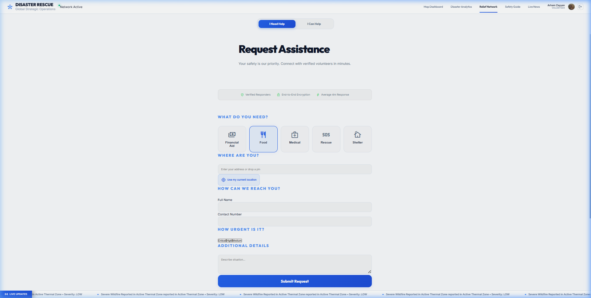

### Description
The **Request Assistance** form allows disaster-affected individuals to submit a structured help request that is then visible to volunteers on the Volunteer Dashboard.

### Key Elements

#### Trust Indicators
Three badges displayed at the top to reassure users:
- ✅ Verified Responders
- 🔒 End-to-End Encryption
- ⚡ Average 4m Response

#### What Do You Need? (Aid Type Selection)
Five selectable categories for the type of assistance needed:
| Category | Icon |
|---|---|
| Financial Aid | 💳 |
| Food | 🍽️ |
| Medical | 💊 |
| Rescue | 🆘 |
| Shelter | 🏠 |

#### Location Input
- A free-text field to type an address
- **"Use my current location"** button to auto-detect GPS coordinates

#### Contact Information
- Full Name field
- Contact Number field

#### Urgency Level
Three priority buttons to indicate severity: **Critical**, **High**, **Medium**

#### Additional Details
A text area for the requester to describe their situation in detail.

#### Submit Request
A prominent blue **Submit Request** button that saves the form to the Supabase database and makes it visible to volunteers.

---

## 6. QR Code Payment Modal

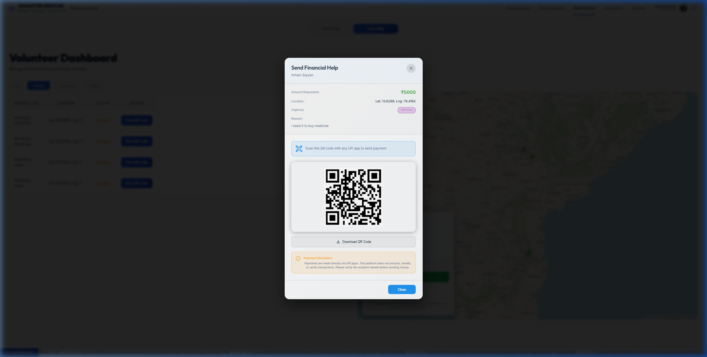

### Description
When a volunteer clicks **"View QR Code"** on a monetary assistance request, a **Send Financial Help** modal appears. This enables direct peer-to-peer UPI payments to the person in need, bypassing traditional banking infrastructure.

### Key Elements
| Element | Description |
|---|---|
| **Requester Name** | Displays the verified name of the person requesting aid. |
| **Amount Requested** | Shows the specific amount needed (e.g., ₹5000). |
| **Location** | GPS coordinates of the requester. |
| **Urgency Badge** | Color-coded urgency level (e.g., CRITICAL in red). |
| **Reason** | The reason stated by the requester (e.g., "I need it to buy medicine"). |
| **QR Code** | A scannable UPI QR code to send money directly via any UPI app (GPay, PhonePe, etc.). |
| **Download QR Code** | Button to save the QR code image locally. |
| **Payment Disclaimer** | Warns that payments are made directly via UPI and the platform does not process or verify transactions. |

---

## 7. Safety Guidelines

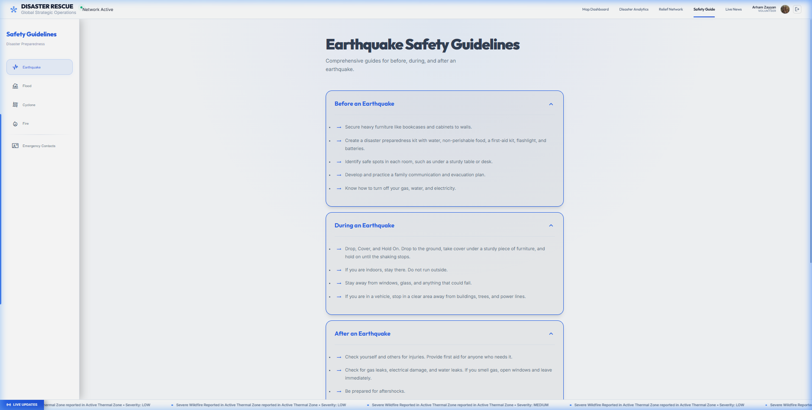

### Description
The **Safety Guidelines** page provides comprehensive, actionable disaster preparedness guides organized by disaster type, with expandable accordion-style sections covering what to do before, during, and after each event.

### Disaster Categories (Left Sidebar)
| Category | Coverage |
|---|---|
| **Earthquake** | Structural safety, evacuation routes, drop-cover-hold procedures |
| **Flood** | Water safety, evacuation planning, post-flood hygiene |
| **Cyclone** | Shelter-in-place protocols, storm surge awareness |
| **Fire** | Evacuation plans, fire extinguisher use, emergency exits |
| **Emergency Contacts** | Global and local emergency hotline numbers |

### Guide Sections (Accordion-Style)
Each disaster type contains three expandable sections:
- **Before** — Preparation steps (e.g., build a kit, know your evacuation route)
- **During** — Immediate action steps (e.g., Drop, Cover, Hold On for earthquakes)
- **After** — Recovery procedures (e.g., check for gas leaks, seek first aid)

---

## 8. Strategic Intelligence Feed (Live News)

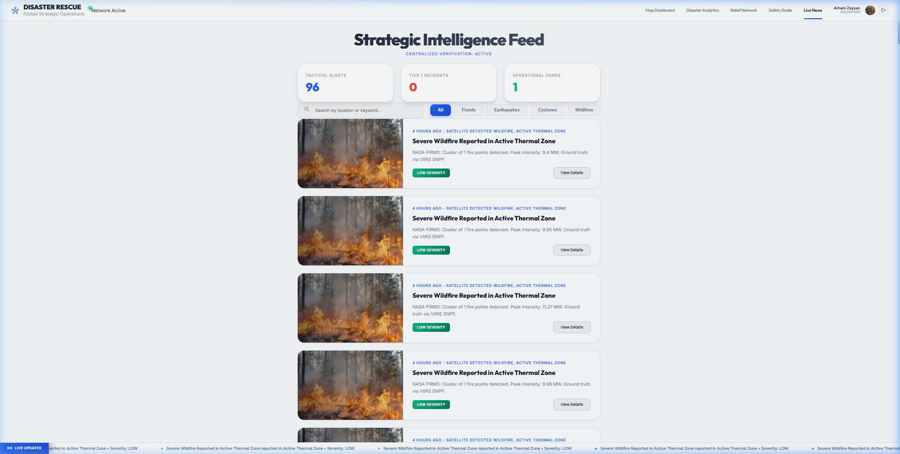

### Description
The **Strategic Intelligence Feed** (Live News) is a real-time disaster alert news feed aggregating satellite and sensor-driven reports. It provides a human-readable, searchable, categorized view of ongoing incidents with supporting imagery.

### Key Elements

#### Header Metrics
| Metric | Description |
|---|---|
| **Tactical Alerts** | Total number of active verified alerts. |
| **Tier 1 Incidents** | Count of the most severe, highest-priority events. |
| **Operational Zones** | Number of active geographic sectors being monitored. |

#### Search & Filter Bar
- A **search field** to filter alerts by location or keyword
- **Category filter tabs**: All | Floods | Earthquakes | Cyclones | Wildfires

#### Alert Cards
Each card displays:
- A **thumbnail image** of the disaster type
- **Timestamp** and data source (e.g., "4 Hours Ago · Satellite Detected Wildfire")
- **Alert Title** (e.g., "Severe Wildfire Reported in Active Thermal Zone")
- **Description**: NASA FIRMS data including fire cluster size and peak intensity (MW)
- **Severity Badge**: LOW / MEDIUM / HIGH / CRITICAL
- **View Details** button: Opens the Disaster Detail Panel on the map

---

## 9. Disaster Detail Panel

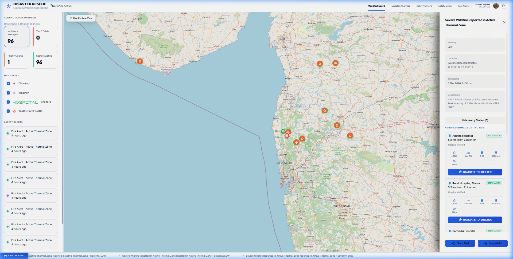

### Description
Clicking **"View Details"** on any alert (from the news feed or directly from a map marker) opens a **Disaster Detail Panel** on the right side of the Map Dashboard. The map simultaneously zooms and pans to the relevant incident location.

### Panel Contents
| Field | Description |
|---|---|
| **Title** | Full incident name (e.g., "Severe Wildfire Reported in Active Thermal Zone") |
| **Severity** | Low / Medium / High / Critical |
| **Location** | GPS coordinates (exact Lat/Lon from satellite detection) |
| **Timestamp** | Date and time of the last detected reading |
| **Description** | Full data from NASA FIRMS: fire cluster count, peak intensity (MW), sensor source (VIIRS SNPP) |
| **Nearby Shelters** | "Hide Nearby Shelters (5)" toggle to show/collapse verified shelter options |

#### Verified NDMA Scouting Hub (Shelter List)
For each nearby shelter, the panel shows:
- **Hospital/Shelter Name**
- **Distance from Epicenter** (e.g., 5.8 km)
- **Match Score** (e.g., 100% Match)
- Capacity, beds, and available resources
- **Navigate to Shelter** button (GPS-linked navigation)

#### Action Buttons
| Button | Action |
|---|---|
| **Share Alert** | Shares the incident details externally |
| **Request Aid** | Directly links to the assistance request form pre-filled with the incident location |

---

## 10. Live Wind / Cyclone Map Layer

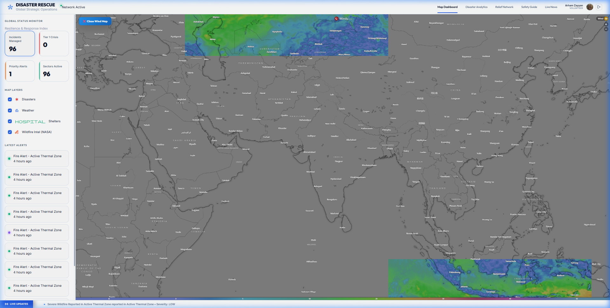

### Description
The **Live Cyclone View** is a toggleable weather overlay on the Map Dashboard. When activated, it switches the base map to a dark satellite/terrain style and overlays a **real-time global wind and weather visualization** tile layer (powered by Windy.com or equivalent live weather API).

### Key Elements
- A **"Close Wind Map"** button in the top-left of the map to deactivate the layer
- A **"Windy"** attribution badge in the top-right
- Color-coded wind speed and atmospheric pressure gradients covering the globe
- Useful for tracking active cyclone paths, storm systems, and severe weather events that may compound ground-level disaster situations

---

## 11. Authentication — Login

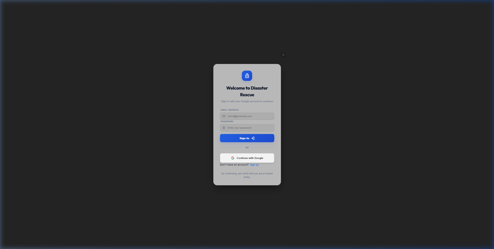

### Description
The **Login Modal** appears when a user clicks **"Login"** in the top navigation bar (or when attempting to access role-protected features). Authentication is powered by **Supabase Auth**.

### Key Elements
| Element | Description |
|---|---|
| **Email Address** field | Standard email input |
| **Password** field | Secure password input |
| **Sign In** button | Authenticates user with email/password via Supabase |
| **Continue with Google** | OAuth 2.0 sign-in using Google account |
| **Sign up** link | Switches the modal to the registration view |
| **Trust statement** | "By continuing, you verify that you are a trusted entity." |

---

## 12. Authentication — Sign Up

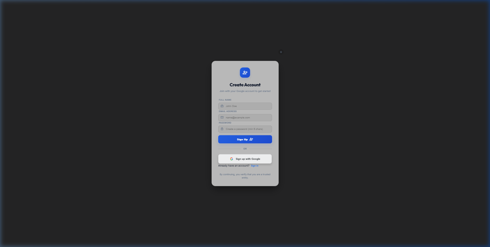

### Description
The **Sign Up (Create Account) Modal** allows new users to register. Upon registration, users gain access to protected features such as submitting relief requests, viewing the volunteer dashboard, and interacting with the shelter navigation system.

### Key Elements
| Element | Description |
|---|---|
| **Full Name** field | User's display name used throughout the app |
| **Email Address** field | Account identifier |
| **Password** field | Minimum 6 characters required |
| **Sign Up** button | Creates the account via Supabase and logs the user in |
| **Sign up with Google** | OAuth 2.0 registration using Google |
| **Already have an account? Sign in** | Switches the modal back to the Login view |
