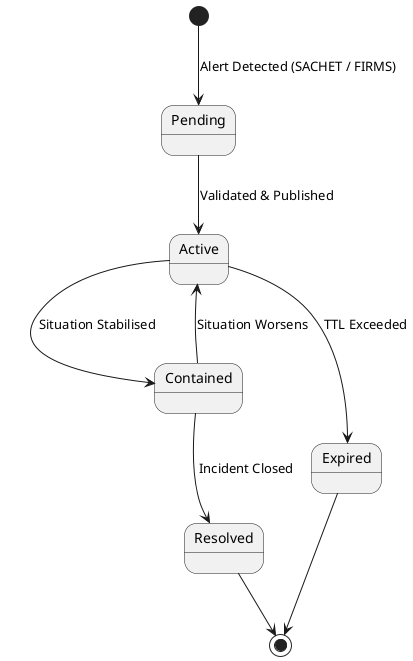
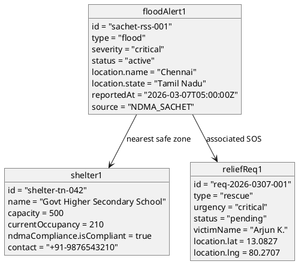

# UML Diagrams — Disaster Evacuation Management System

---

## 1. Use Case Diagram

**Description:**  
Shows how different actors interact with the system's major features.

**Actors:**
- **Victim/General User** — can authenticate, view the live disaster map, post SOS requests, and locate shelters.
- **Volunteer/Rescue Team** — can authenticate, view the map, and manage relief operations.
- **Admin** — can authenticate and access analytical reports.
- **NASA/NDMA (External)** — automatically feeds satellite wildfire and disaster alert data into the system.

**Key Use Cases:** Authenticate, View Live Disaster Map, Post SOS Request, Find Shelters, Manage Relief Operations, Ingest Satellite Data, View Analytics.

**Explanation:**  
This diagram defines the scope of the system from the user's perspective. It shows that a victim's primary goal is to seek help and find safety, while volunteers coordinate responses. External systems (NASA FIRMS, NDMA SACHET) are treated as automated actors that continuously supply live data.

---

## 2. Class Diagram

**Description:**  
Represents the core data structures and service classes of the application.

**Key Classes:**
- **Disaster** — holds disaster type, severity, location, status, and metadata from satellite sources.
- **Shelter** — represents an evacuation shelter with capacity, NDMA compliance details, and contact info.
- **ReliefRequest** — a user-submitted SOS with urgency level and current status.
- **DisasterDataService** — fetches and merges disaster data from NDMA SACHET and Supabase.
- **FirmsIngestionService** — polls NASA FIRMS CSV data, clusters fire points, and writes to the database.
- **ShelterService** — queries the Overpass/OpenStreetMap API for nearby shelters.

**Explanation:**  
This diagram captures the object-oriented design. Services are decoupled from UI and communicate via typed interfaces (`Disaster`, `Shelter`, `ReliefRequest`), making the codebase modular and testable.

---

## 3. Sequence Diagram

**Description:**  
Illustrates the step-by-step interaction between a User, the map UI, the data service, and the database when loading the dashboard.

**Flow:**
1. User opens the dashboard.
2. `DisasterMap` triggers `fetchAllDisasters()` on `DisasterDataService`.
3. The service queries Supabase for stored disaster records.
4. Supabase returns a data payload.
5. The service returns a normalized disaster array to the UI.
6. The UI renders all markers on the Leaflet map.
7. When the user drags the sidebar to resize, the map calls `invalidateSize()` to reflow correctly.

**Explanation:**  
This diagram shows the runtime message flow for the most critical user journey — loading the live disaster map. It highlights the asynchronous nature of data fetching and how the map reactively updates without requiring a page reload.

---

## 4. Activity Diagram

**Description:**  
Models the application startup and initialization workflow as a flowchart.

**Flow:**
1. Vite launches the React app.
2. Supabase checks authentication state.
3. If authenticated, the user joins real-time relief channels; otherwise, a public-only view is shown.
4. Three tasks run in parallel (fork):
   - Fetch live NDMA SACHET RSS alerts.
   - Fetch NASA FIRMS satellite wildfire detections.
   - Initialize the Leaflet map centered on India.
5. Data is normalized and deduplicated (merging official + satellite sources).
6. Disaster and relief markers are rendered on the map.

**Explanation:**  
The parallel fork is a key design choice — data from multiple sources is fetched concurrently to minimize load time. Deduplication ensures that the same event reported by both NDMA and NASA only appears once on the map.

---

## 5. Component Diagram

**Description:**  
Shows the major software components and their dependencies.

**Components:**
- **UI Components** — `Header`, `DisasterMap`, `ReliefDashboard`, `Sidebar (Resizable)` — form the frontend interface.
- **Core Services** — `Auth Service`, `Disaster Service`, `Shelter Service` — handle all business logic and external API communication.
- **External APIs** — `NDMA SACHET`, `NASA FIRMS`, `Overpass/OSM`, `Supabase Auth`.

**Relationships:**
- `DisasterService` calls NDMA SACHET and NASA FIRMS APIs.
- `ShelterService` queries the OpenStreetMap Overpass API.
- `AuthService` delegates to Supabase Auth.
- `DisasterMap` subscribes to Supabase Realtime for live updates.

**Explanation:**  
This diagram highlights the system's modular architecture. The UI components are completely decoupled from data sources — they only talk to the core services, which in turn abstract all external API calls. This makes swapping or adding data sources straightforward.

---

## 6. Deployment Diagram

**Description:**  
Shows where and how the system's components are physically hosted and connected.

**Nodes:**
- **User Browser** — runs the React/Vite application client-side.
- **Vercel Hosting** — serves the compiled production build over HTTPS.
- **Supabase Cloud** — hosts the PostgreSQL database, real-time engine, and authentication service.
- **Data Providers** — external cloud endpoints: NDMA SACHET RSS, NASA FIRMS VIIRS, and OpenStreetMap/OSRM.

**Connections:**
- Browser ↔ Vercel: HTTPS (web app delivery).
- Browser ↔ Supabase: WebSocket (real-time) + HTTPS (REST queries).
- Vercel/Browser → Data Providers: HTTPS API calls.

**Explanation:**  
The deployment is entirely cloud-based with no custom backend server. The Vite frontend runs in the browser and communicates directly with Supabase (BaaS) and public data APIs. Vercel provides global CDN delivery, making the app fast and highly available.

---

## 7. State Diagram

**Description:**  
Models the lifecycle states of a `Disaster` alert object, from the moment it is detected to when it is closed or expired.

**States:**
- **Pending** — Alert detected by NDMA SACHET RSS or NASA FIRMS; awaiting validation.
- **Active** — Confirmed and broadcasting on the live map; rescue teams notified.
- **Contained** — Situation under control; alert still visible but downgraded in severity.
- **Resolved** — Incident fully closed; removed from the live map feed.
- **Expired** — Alert TTL (time-to-live) passed with no update; auto-archived.

**Explanation:**  
This diagram captures the complete lifecycle of a disaster alert as it flows through the system. The `active` state is the most critical — it triggers UI markers, SOS routing, and rescue team notifications. The distinction between `contained` and `resolved` mirrors real-world incident management, where containment is partial control and resolution is full closure. The `expired` path handles stale alerts automatically without manual admin intervention.



---

## 8. Timing Diagram

**Description:**  
Shows the time-based interactions between the system's data ingestion pipelines and the UI over a 15-minute operational window.

**Lifelines:**
- **NASA FIRMS Poller** — runs every 15 minutes; throttled using a `localStorage` timestamp to prevent API rate limit abuse.
- **NDMA SACHET Feed** — fetched on app load, then on a 10-minute `setInterval`.
- **Supabase Realtime** — persistent WebSocket connection that pushes DB changes instantly to the client.
- **Leaflet Map UI** — re-renders markers whenever new data arrives from any source.

**Explanation:**  
The staggered polling intervals (FIRMS at 15 min, SACHET at 10 min) prevent simultaneous API bursts. Supabase Realtime fills the gaps between polls by pushing any admin-triggered updates instantly, ensuring the map is always as current as possible. This design balances freshness of data with responsible API usage.

```plantuml
@startuml
concise "NASA FIRMS Poller" as F
concise "NDMA SACHET Feed" as S
concise "Supabase Realtime" as DB
concise "Leaflet Map UI" as UI

@0
F : Idle
S : Idle
DB : Connected
UI : Idle

@1
S : Fetching
UI : Loading

@3
S : Idle
UI : Rendering

@4
DB : Push Update
UI : Re-render

@5
F : Fetching

@8
F : Idle
UI : Re-render

@15
S : Fetching
F : Fetching
UI : Loading
@enduml
```

---

## 9. Object Diagram

**Description:**  
A runtime snapshot of concrete object instances when an active flood alert is live and a victim has posted an SOS request.

**Instances:**
- **floodAlert1** — a `Disaster` instance: type `flood`, severity `critical`, status `active`, sourced from NDMA SACHET, located in Chennai, Tamil Nadu.
- **shelter1** — a `Shelter` instance: a government school near the disaster zone with 210/500 occupancy and NDMA compliance verified.
- **reliefReq1** — a `ReliefRequest` instance: a `rescue` type SOS posted by a victim with `critical` urgency, status `pending`.

**Explanation:**  
While the Class Diagram defines the blueprint, the Object Diagram shows a real-world snapshot. It validates that the data model can represent an active emergency scenario end-to-end — from detection (floodAlert1) to infrastructure response (shelter1) to individual victim need (reliefReq1). The links between objects confirm the system's ability to associate an SOS with both an event and a nearby safe zone.


